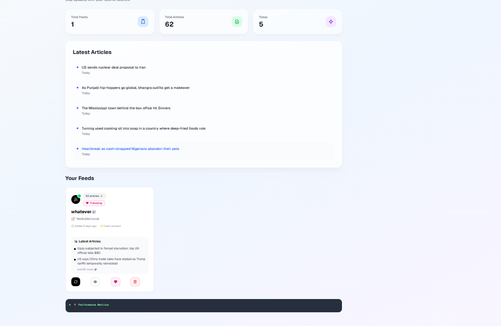

# Scrapper Frontend

This is the frontend for the Scrapper application, built with Next.js. It provides a user interface to view and scrape RSS feeds, integrated with the backend API.



## Features

- Displays a list of feeds and their items.
- Allows users to scrape feeds and view the latest items.
- Handles user authentication with Firebase.
- Responsive design with a clean UI.

## Prerequisites

- Node.js (16.x or later)
- npm (or yarn)
- Backend running at `http://localhost:8080`

## Setup

1. Clone the repository:

   ```bash
   git clone https://github.com/kwabena369/scrapper-frontend.git
   cd scrapper-frontend
   ```

2. Install dependencies:

   ```bash
   npm install
   ```

3. Set up environment variables:

   - Create a `.env.local` file with:

     ```env
     NEXT_FIREBASE_API_KEY=your-api-key
     NEXT_FIREBASE_AUTH_DOMAIN=your-auth-domain
     NEXT_FIREBASE_PROJECT_ID=your-project-id
     NEXT_FIREBASE_STORAGE_BUCKET=your-storage-bucket
     NEXT_FIREBASE_MESSAGING_SENDER_ID=your-sender-id
     NEXT_FIREBASE_APP_ID=your-app-id
     NEXT_PUBLIC_BACKEND_URL=http://localhost:8080
     ```

   - Obtain Firebase config from your Firebase Console.

4. Run the development server:

   ```bash
   npm run dev
   ```

   Open [http://localhost:3000](http://localhost:3000) in your browser.

## Usage

- Navigate to `/feed/:id` to view a specific feed (e.g., `/feed/683992d1d712dbfef549a6c3`).
- Click "Scrape Feed" to fetch new items.
- Authenticate via the `/auth` page if required.

## Development

- Use `npm run lint` and `npm run format` for code quality.
- Add components in the `components` directory.
- Extend API calls in `lib/firebase.js` or `pages/api` if needed.


## License

MIT License (specify if different).
```
## Backend 
   ```bash
   git clone https://github.com/kwabena369/scrapper.git
   ```
